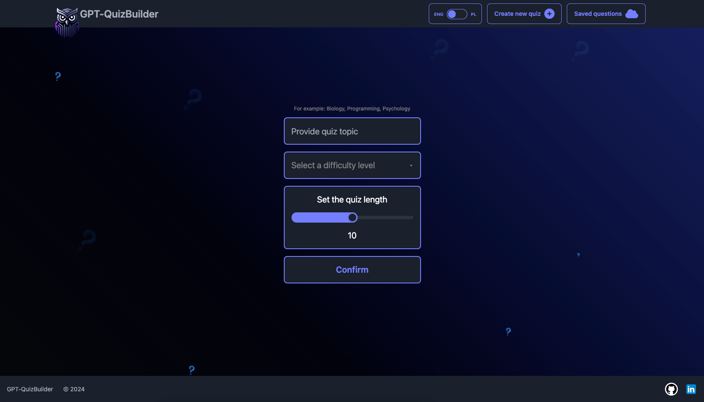
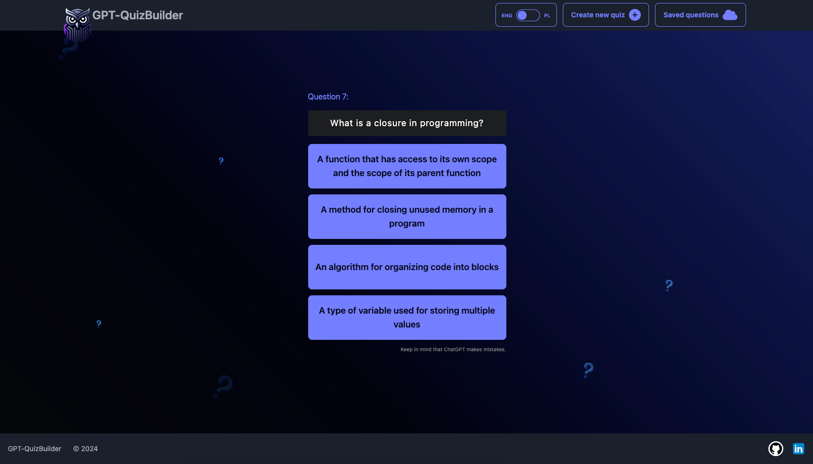
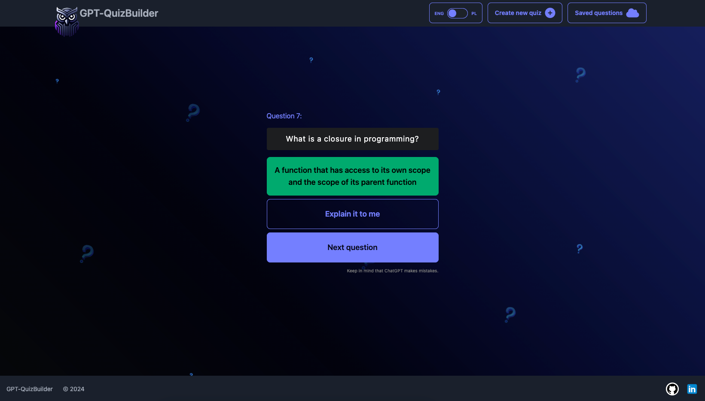
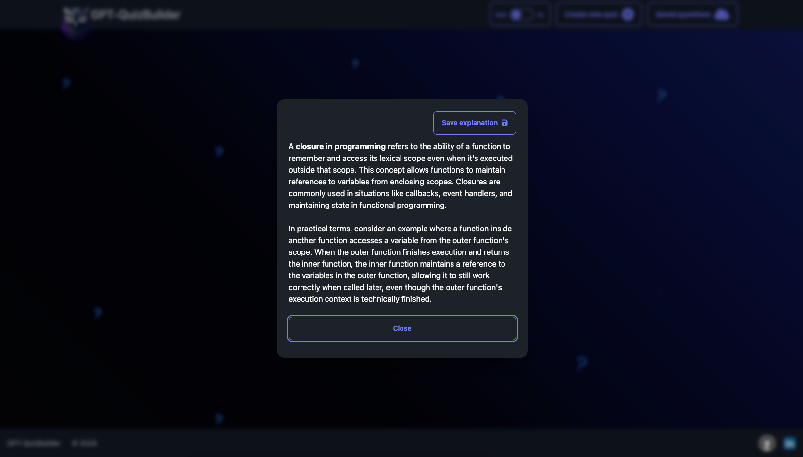
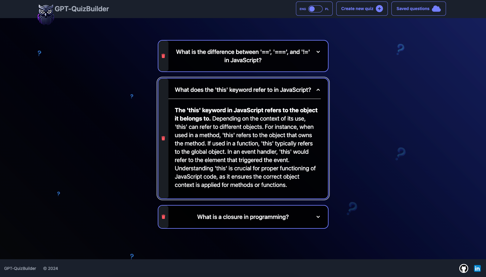

## GPT-QuizBuilder

<table>
  <tr>
    <td></td>
    <td>
      
GPT-QuizBuilder is a project aimed at creating personalized quizzes for educational purposes by connecting to the OpenAI API. Users will be able to select the topic, duration, and difficulty level of the quiz.

      <strong>In progress:</strong> 
    </td>
  </tr>
</table>

## Main menu

  
  
## How it works
**Provide quiz topic & choose difficulty level**

**Answer questions by choosing one option**

**Get extra explanations if you don't understand a question or answer**

**Check all stats and review saved questions with explanations**

## How to Use

<a href="https://gpt-quiz-builder.vercel.app/">LIVE DEMO </a>

## Features

- **Personalized Quizzes:** Generate quizzes tailored to the user's preferences.
- **Topic Selection:** Choose from a variety of topics for the quiz.
- **Duration Control:** Set the duration of the quiz according to your preference.
- **Difficulty Level:** Adjust the difficulty level of the quiz.
- **Feedback:** Receive feedback and explanations for answers to enhance understanding.
- **Quiz Statistics:** Track performance and progress over time.
- **Question Bank:** Maintain a repository of unanswered questions for revision.
- **Translation:** Change the language of the interface between English and Polish.

## Future Enhancements

- **Tutorial Page:** Add a page with step-by-step instructions on how to use the application and the best practices for learning with it.
- **User Authentication:** Implement a login system for users.
- **Top QuizMasters:** Recognize top performers based on their quiz scores.

## Contributing

Contributions are welcome! If you'd like to contribute to this project, please follow these steps:

1. Fork the repository.
2. Create your feature branch (`git checkout -b feature/YourFeature`).
3. Commit your changes (`git commit -am 'Add some feature'`).
4. Push to the branch (`git push origin feature/YourFeature`).
5. Create a new Pull Request.

## License

This project is licensed under the [MIT License](LICENSE).

## Acknowledgements

- [OpenAI](https://openai.com/) for providing the API used in this project.
- Contributors to libraries and frameworks used in this project.
